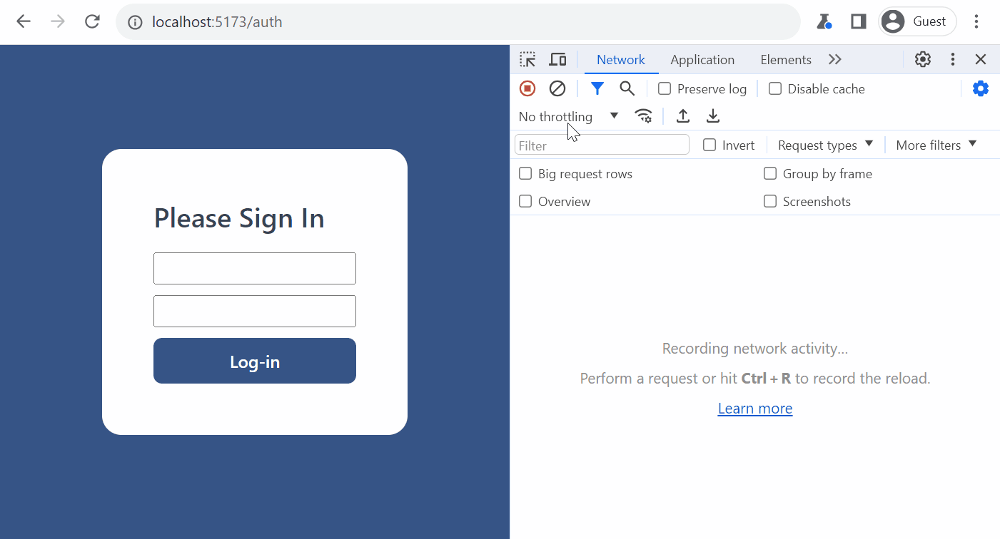

# To-do list with auth

Just an exercise for myself to practice more the following tech stack:

- React:
  - Custom hooks (own TanStack Query simplified interpritation - useQuery & useMutation hooks).
  - Axios: used an interceptor to refresh Access Token.
  - UseReducer hook - reducer function to manage Todos state.
- TypeScript (types, interfaces, generics, enums)
- Node/Express to build auth (login & refresh utilizing JWT) endpointes and todos endpoints (according to RESTful API - for getting, adding, updating and deleting to-do items)

### Here there is a small demo:

